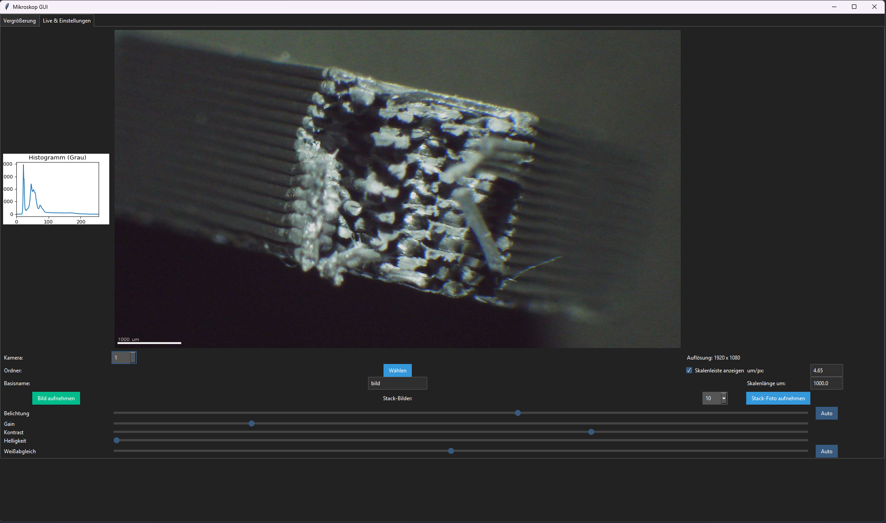

# Microscope Camera GUI

This is a Python application that provides a live view, image capture, focus stacking, and measurement tools for USB microscopes. It uses OpenCV for image acquisition and processing, Tkinter (with ttkbootstrap) for the GUI, and matplotlib for live histogramming.

> **Note:** The current GUI is temporarily available only in German.

## Features

- **Live Video Preview** at a fixed display resolution (1280×720).
- **Live Histogram** (grayscale) displayed alongside the video feed.
- **Image Capture** and saving to TIFF format with automatic sequential naming.
- **Static stacking** capture N frames and compute an averaged (or focus‐stacked) result.
- **Scale Bar Overlay**: configurable µm/px calibration and scale length.
- **Camera Controls**: sliders for exposure, gain, contrast, brightness, and white balance (with auto modes).
- **Magnification Calibration**: tab to switch between 1×, 2×, and 4× magnification, automatically updating calibration values.

## Requirements

- Python 3.8 or higher
- OpenCV (`opencv-python`)
- NumPy
- Pillow
- tifffile
- matplotlib
- ttkbootstrap

Install dependencies via:

```bash
pip install opencv-python numpy pillow tifffile matplotlib ttkbootstrap
```

## Installation & Usage

1. Clone this repository:
```bash
git clone https://github.com/yourusername/microscope-camera-gui.git
cd microscope-camera-gui
```
2. Run the application:
```bash
python Micro_Cam_QND.py
```
3. In the GUI:
   - Select your USB microscope from the **Kamera** dropdown.
   - Choose a save folder and base filename.
   - Adjust camera settings with sliders or use **Auto** buttons.
   - Enable/disable the scale bar and set calibration values.
   - Click **Bild aufnehmen** to capture a single image.
   - Use **Stack-Foto aufnehmen** or live stack controls for focus stacking.
   - Click in the video feed to start a measurement, then click a second point to see the distance in µm.

## Localization Note

The GUI labels and messages are currently in **German**. An English localization is planned for a future release.

## License

MIT License

